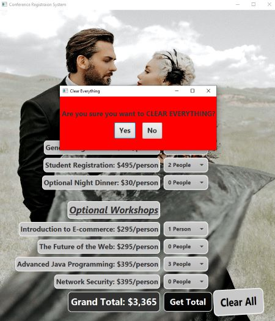

<h1 align="center">Welcome to Conference GUI</h1>

<!--  -->

<h4 align="center">
  Javafx: uses combo boxes to make selections.  The value of those selections are multiplied for the given price.  The total button adds everything up and displays the total dollar amount.  A second stage is displayed when the user clicks on Clear All.  
</h4>
 

<h2 align="center" style="text-decoration: underline;">Using this GUI is as follows:</h2>

<h4 align="center">
    1. Click on People for a drop down menu to appear.  Select the amount of people for general registration and/or student registration.

</h4>

<h4 align="center">
    2. Then proceed to select how many optional night dinners and workshops you would like to attend.

</h4>

<h4 align="center">
    3. Once all selections have been made, click on the Get Total button for the total amount to be displayed.

</h4>

<h4 align="center">
    4. If you would like to start over, simply click on the Clear All button.

</h4>

<h4 align="center">
    5. Another window will appear asking if you would like to clear everything.  Click on Yes will clear everything and No will return you to what you have selected.
    

    

</h4>

<h2 align="center" style="text-decoration: underline;">Errors:</h2>

<h4 align="center">
    1. A error will occur when more workshops or optional night dinners have been selected than the amount registered.  A error message is displayed along with the selections that are in violation.

</h4>

<!-- For more details see [GitHub Flavored Markdown](https://guides.github.com/features/mastering-markdown/). -->
<!-- You can use the [editor on GitHub](https://github.com/zuki07/Generic_array_list1/edit/gh-pages/index.md) to maintain and preview the content for your website in Markdown files. -->
